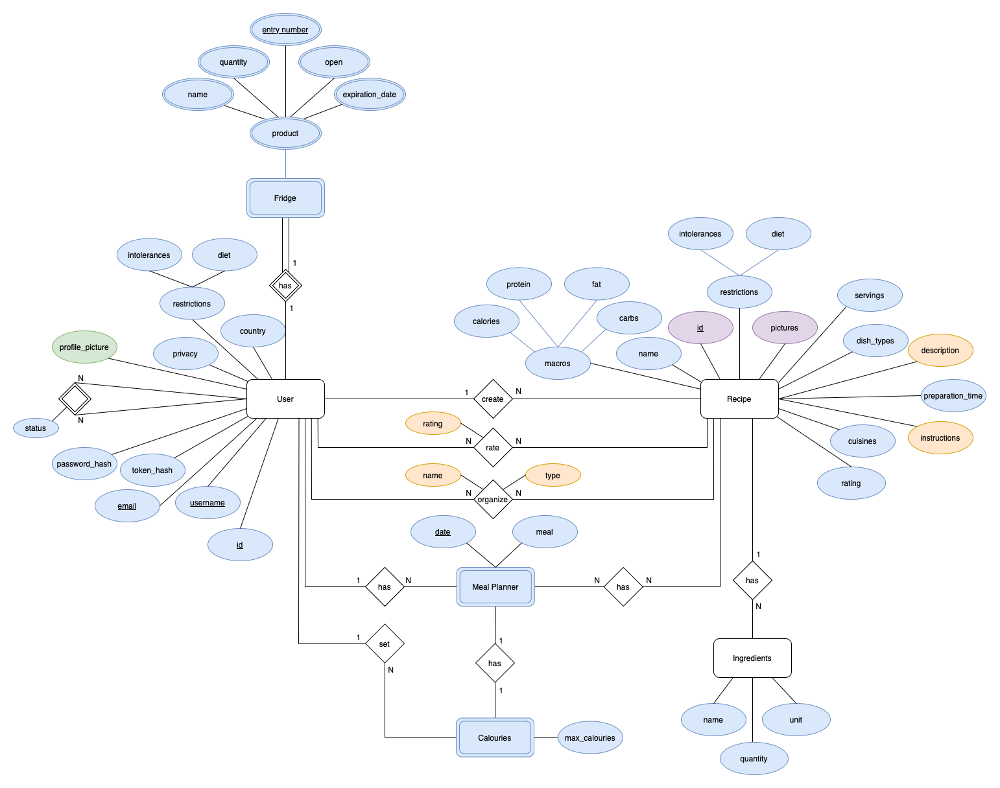
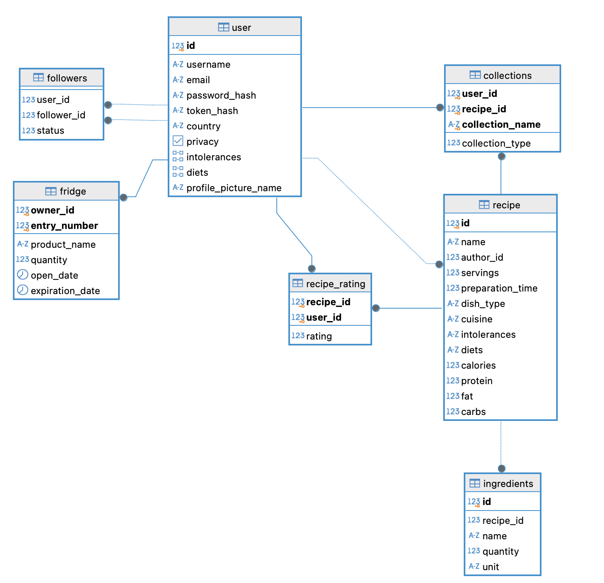

# Epicurius - Technical Document
This document contains the backend internal software organization and the data model.

## Introduction
The backend server exposes a HTTP API that provides a system for the Epicurius Mobile App.

The __domain__ of the system contains the ``User``, ``Token``, ``Fridge``, ``Recipe``, ``Collection`` and ``Meal Planner`` entities which are described as follows:

* A __User__ is characterized by an unique number, an unique username, an unique email, an unique token, a password, a country, privacy, intolerance list, diet list and a profile picture;

* A __Token__ is characterized by a unique token hashed, the date of the last time it was used and a unique number, that represents the user to who it belongs;

* A __Fridge__ consists of a list of __Product__ characterized by product name, an unique entry number, quantity, open date and expiration date;

* A __Recipe__ is characterized by a unique number, the recipe's name, the id of the author, a description, servings, preparation time, type of cuisine, type of meal, a list of intolerances, a list of diets, the ingredients list, number of calories, proteins, fat, carbohydrates, a map with the instructions and a list of images;

* A __Collection__ is characterized by a unique number, the collection's name and type (``Kitchen Book`` or ``Favourites``) and a list of recipes associated to the collection;

* A __Meal Planner__ consists of a list of __Daily Meal Planner__. Each __Daily Meal Planner__ is characterized by a date, the maximum number of calories for the day, and a map where the keys are the meal times, and the values are the recipes associated with those times.


The __backend__ was developed using __Kotlin__ technology. In order to  __handle/receive HTTP requests__, the [__Spring MVC__](https://docs.spring.io/spring-framework/reference/web/webmvc.html) library was used. The specific __data__ of the application is __stored__ in a __Postgresql database__, __Firestore database__ and __Cloud Storage__. The __backend__ also interacts with external APIs such as the [__Spoonacular API__](https://spoonacular.com/food-api/docs) and the [__Vision API__](https://cloud.google.com/vision/docs).


## Data Model

### Conceptual model

The conceptual data model of the backend server is represented in the following diagram, that holds the entity-relationship diagram of the database:



#### Design Restrictions

* __Followers Table__ 
    * The _follower id_ attribute of __Followers Table__ cannot be the same as the _user id_;

* __Recipe Table__
    * Attributes _servings_ and _preparation time_ have to be bigger than 0;
    * _meal type_ attribute has a range between 0 and 12, whereas the _cuisine_ attributes is ranged between 0 and 25;
    * Attributes associated with nutricional informations like _calories_, 
    _protein_, _fat_ and _carbs_ have to be bigger or equal 0 if associated with actual value;
    * The attribute _pictures names_ is an array which size must be comprehend between 1 and 3;

* __Recipe Rating Table__
    * _user id_ attribute has to be different from recipe's author id, the author cannot rate their own recipe;
    * Attribute _rating_ value is only accepted if between 1 and 5;

* __Collection Table__
    * The _type_ attribute can only assume value 0 or 1;

* __Meal Planner Table__
    * Attribute _max calories_ has to be bigger than 0;

* __Meal Planner Recipe Table__
    * _meal time_ attribute is ranged between 0 and 3;

### Physical Model

The physical data model contains the implementation of the conceptual data model in the PostgreSQL database, that can be found in the [__createTables.sql__](./src/sql/createTables.sql) file.



#### Design Aspects

The tables __User__, __Recipe__ and __Meal Planner Recipe__ use arrays of integer to represent outside data, this design applies to the three models.

__User__ and __Recipe__ tables both use an integer array to represent the __Intolerances__ and __Diets__. __Intolerances__ and __Diets__ are enum classes that include the __accepted terms__ in the application. The integers in the array correspond to the index of the intolerance or diet in the enum class (e.g. ``intolerances { 3 } = GRAIN``; ``diets { 2,6 } = VEGETARIAN, PESCETARIAN``).

It is important to notice that in the __Recipe__ table there are two more attributes with the same logic, but in this case it is only one integer instead of an array. The __Meal Type__ and __Cuisine__ attribute represent the index in the corresponding enum class (e.g. ``meal_type 1 = MAIN_COURSE``; ``cuisine 10 = GERMAN``).

Once again the same logic as the previous one is repeated in the __Meal Planner Recipe__ table, but for the __Meal Time__ attribute (e.g. ``meal_time 0 = BREAKFAST``)

In __Recipe__ table is used an array of varchar, __Pictures Names__ attribute, in order to store the name of the pictures related to the recipe. 

## Application Architecture

### Software organization

The backend server is organized in the following packages:
* [/config](./src/main/kotlin/epicurius/config), which contains the classes that configure the databases and pipeline used by the application - [see more](#config);
* [/http](./src/main/kotlin/epicurius/http), which contains the classes used to process the HTTP requests - [see more](#http);
* [/services](./src/main/kotlin/epicurius/services), which contains the classes that perform validations of parameters and implement the logic of the operations - [see more](#services);
* [/repository](./src/main/kotlin/epicurius/repository), which contains the interfaces and implementations that are used to access databases - [see more](#repository);
* [/domain](./src/main/kotlin/epicurius/domain), which contains all the core entities of the application - [see more](#domain);


#### Config

The config package contains the ``Configuration`` classes that configure the __beans__ to access the __PostgreSQL__, __Firestore__ and __Cloud Storage__ databases and the __pipeline__ used to handle/process HTTP requests.

The config package is organized in the following classes:
* [DatabaseConfigurer](./src/main/kotlin/epicurius/config/DatabaseConfigurer.kt), which contains the configurations to access the PostgreSQL, Firestore and Cloud Storage databases;
* [PipelineConfigurer](./src/main/kotlin/epicurius/config/PipelineConfigurer.kt), which contains the configurations for the interceptors and argument resolvers of the pipeline;

This package also contains the [HttpClientConfigurer](./src/main/kotlin/epicurius/config/HttpClientConfigurer.kt) used to configure an HTTP Client to interact with the ``Spoonacular`` and ``Cloud Function`` endpoints.


#### HTTP

The HTTP package contains the ``RestController`` and pipeline classes that process the HTTP requests.

The controllers are organized in the following classes:
* [CollectionController](./src/main/kotlin/epicurius/http/controllers/collection/CollectionController.kt), which contains the controller related to the `Collection` entity;
* [FeedController](./src/main/kotlin/epicurius/http/controllers/feed/FeedController.kt), which contains the controller related to the __get feed__ operation;
* [FridgeController](./src/main/kotlin/epicurius/http/controllers/fridge/FridgeController.kt), which contains the controller related to the `Fridge` entity;
* [IngredientsController](./src/main/kotlin/epicurius/http/controllers/ingredients/IngredientsController.kt), which contains the controller related to the __get Ingredients__, __get substitute ingredients__ and __get ingredients from a picture__ operations;
* [MealPlannerController](./src/main/kotlin/epicurius/http/controllers/mealPlanner/MealPlannerController.kt), which contains the controller related to the `MealPlanner` entity;
* [MenuController](./src/main/kotlin/epicurius/http/controllers/menu/MenuController.kt), which contains the controller related to the __get daily menu__ operation;
* [RateRecipeController](./src/main/kotlin/epicurius/http/controllers/rateRecipe/RateRecipeController.kt), which contains the controller related to the __recipe rating__ operations;
* [UserController](./src/main/kotlin/epicurius/http/controllers/user/UserController.kt), which contains the controller related to the `User` entity;


The pipeline is organized in the following classes:
* [AuthenticationInterceptor](./src/main/kotlin/epicurius/http//pipeline/authentication/AuthenticationInterceptor.kt), which contains the interceptor class that process the authentication before the controller methods;
* [AuthenticatedUserArgumentResolver](./src/main/kotlin/pt/isel/daw/gomoku/http/pipeline/), which contains the method argument resolver class that process the authenticated argument in the authenticated controller methods;
* [ExceptionHandler](./src/main/kotlin/epicurius/http/pipeline/ExceptionHandler.kt), which contains the handler that process the exceptions thrown by the application - [see more](#error-handling)


#### Services

The services package contains the classes that perform validations of parameters and implement the logic of the operations. It is responsible for receiving the parameters from the controllers, validating them and calling the corresponding repository methods to access the database.

The services are organized in the following classes:
* [CollectionService](./src/main/kotlin/epicurius/services/collection/CollectionService.kt), which contains the services related to the `Collection` entity;
* [FeedService](./src/main/kotlin/epicurius/services/feed/FeedService.kt), which contains the services related to the __get feed__ operation;
* [FridgeService](./src/main/kotlin/epicurius/services/fridge/FridgeService.kt), which contains the services related to the `Fridge` entity;
* [IngredientsService](./src/main/kotlin/epicurius/services/ingredients/IngredientsService.kt), which contains the services related to the __get Ingredients__, __get substitute ingredients__ and __get ingredients from a picture__ operations;
* [MealPlannerService](./src/main/kotlin/epicurius/services/mealPlanner/MealPlannerService.kt), which contains the services related to the `MealPlanner` entity;
* [MenuService](./src/main/kotlin/epicurius/services/menu/MenuService.kt), which contains the services related to the __get daily menu__ operation;
* [RateRecipeService](./src/main/kotlin/epicurius/services/rateRecipe/RateRecipeService.kt), which contains the services related to the __recipe rating__ operations;
* [RecipeService](./src/main/kotlin/epicurius/services/recipe/RecipeService.kt), which contains the services related to the `Recipe` entity;
* [UserService](./src/main/kotlin/epicurius/services/user/UserService.kt), which contains the services related to the `User` entity;

#### Repository

The repository package contains the interfaces and implementations that are used to access the PostgreSQL database, using the [JDBI](https://jdbi.org/) library, the Firestore database using the [Firestore API](https://cloud.google.com/firestore/docs/reference/rest), the Cloud Storage using the [Cloud Storage Kotlin Library](https://github.com/googleapis/java-storage?tab=readme-ov-file), the Cloud Function and Spoonacular API using an __HTTP client__.

The repository is organized in the following classes:
* [CloudFunctionRepository](./src/main/kotlin/epicurius/repository/cloudFunction/contract/CloudFunctionRepository.kt), which contains the repository related to the __get ingredients from picture__ operation;
* [PictureRepository](./src/main/kotlin/epicurius/repository/cloudStorage/picture/contract/PictureRepository.kt), which contains the repository related to the __get picture__, __update picture__ and __delete picture__ operations;
* [CollectionRepository](./src/main/kotlin/epicurius/repository/jdbi/collection/contract/CollectionRepository.kt), which contains the repository related to the `User` entity;
* [FeedRepository](./src/main/kotlin/epicurius/repository/jdbi/feed/contract/FeedRepository.kt), which contains the repository related to the __get feed__ operation;
* [FridgeRepository](./src/main/kotlin/epicurius/repository/jdbi/fridge/contract/FridgeRepository.kt), which contains the repository related to the `Fridge` entity;
* [MealPlannerRepository](./src/main/kotlin/epicurius/repository/jdbi/mealPlanner/contract/MealPlannerRepository.kt), which contains the repository related to the `MealPlanner` entity;
* [RateRecipeRepository](./src/main/kotlin/epicurius/repository/jdbi/rateRecipe/contract/RateRecipeRepository.kt), which contains the repository related to the __rating of a recipe__ operation;
* [RecipeRepository](./src/main/kotlin/epicurius/repository/jdbi/recipe/contract/RecipeRepository.kt) and [FirestoreRecipeRepository](./src/main/kotlin/epicurius/repository/firestore/recipe/contract/RecipeRepository.kt), which contains the repository related to the `Recipe` entity;
* [TokenRepository](./src/main/kotlin/epicurius/repository/jdbi/token/contract/TokenRepository.kt), which contains the repository related to the `Token` entity;
* [UserRepository](./src/main/kotlin/epicurius/repository/jdbi/user/contract/UserRepository.kt), which contains the repository related to the `User` entity;
* [SpoonacularRepository](./src/main/kotlin/epicurius/repository/spoonacular/contract/SpoonacularRepository.kt), which contains the repository related to the __get ingredients__ and __get substitute ingredients__ operations;

This package also contains the `JdbiTransactionManager` used to access the PostgreSQL database, and the `JdbiConfig` used to register the mappers of the application.

#### Domain

The domain package contains all the core entities of the application, such as:
* [Collection](./src/main/kotlin/epicurius/domain/collection/Collection.kt), which represents a collection of the user;
* [Fridge](./src/main/kotlin/epicurius/domain/fridge/Fridge.kt), which represents the fridge of the user;
* [MealPlanner](./src/main/kotlin/epicurius/domain/mealPlanner/MealPlanner.kt), which represents the planned meals of the user;
* [Recipe](./src/main/kotlin/epicurius/domain/recipe/Recipe.kt), which represents a recipe of a user;
* [User](./src/main/kotlin/epicurius/domain/user/User.kt), which represents the board of a game;

This package also contains the specific custom exceptions that are thrown by the application.


## Open-API Specification

The __routes__ for the __API__ are organized as follow:
* __Authentication__, which contains the authentication routes - [see more](#authentication)
* __User__, which contains the user routes - [see more](#user)
* __Fridge__, which contains the user routes - [see more](#fridge)
* __Recipe__, which contains the user routes - [see more](#recipe)
* __Ingredients__, which contains the user routes - [see more](#ingredients)
* __Collection__, which contains the user routes - [see more](#collection)
* __Meal Planner__, which contains the user routes - [see more](#mealplanner)
* __Menu__, which contains the user routes - [see more](#menu)

#### Authentication

| Method | Route                  | Description                     | Authenticated |
|--------|------------------------|---------------------------------|:-------------:|
| POST   | ``/api/signup``        | Signup a new user to the system |      No       |
| POST   | ``/api/login``         | Login a user user               |      No       |
| POST   | ``/api/logout``        | Logout a user user              |      Yes      |


#### User

| Method  | Route                                     | Description                               | Authenticated | 
|---------|-------------------------------------------|-------------------------------------------|:-------------:|
| GET     | ``/api/users``                            | Search for users                          | Yes           |
| GET     | ``/api/users/{username}``                 | Get a user's profile                      | Yes           |
| GET     | ``/api/user``                             | Get a user                                | Yes           |
| GET     | ``/api/user/intolerances``                | Get a user's intolerances                 | Yes           |
| GET     | ``/api/user/diets``                       | Get a user's diets                        | Yes           |
| GET     | ``/api/user/follow-requests``             | Get a user's follow requests              | Yes           |
| GET     | ``/api/user/followers``                   | Get a user's followers                    | Yes           |
| GET     | ``/api/user/following``                   | Get a user's following users              | Yes           |
| GET     | ``/api/user/feed``                        | Get a user's feed                         | Yes           |
| PATCH   | ``/api/user``                             | Update a user                             | Yes           |
| PATCH   | ``/api/user/picture``                     | Update a user's profile picture           | Yes           |
| PATCH   | ``/api/user/follow/{username}``           | Follow a user                             | Yes           |
| PATCH   | ``/api/user/follow-requests/{username}``  | Accept, Reject or Cancel a follow request | Yes           |
| PATCH   | ``/api/user/password``                    | Reset a user's password                   | No            |
| DELETE  | ``/api/user``                             | Deletes the user                          | Yes           |
| DELETE  | ``/api/user/follow/{username}``           | Unfollow a user                           | Yes           |


#### Fridge

| Method  | Route                                 | Description                      | Authenticated | 
|---------|---------------------------------------|----------------------------------|:-------------:|
| GET     | ``/api/fridge``                       | Get a user's fridge              | Yes           |
| POST    | ``/api/fridge``                       | Add a product to the fridge      | Yes           |
| PATCH   | ``/api/fridge/product/{entryNumber}`` | Update a product in the fridge   | Yes           |
| DELETE  | ``/api/fridge/product/{entryNumber}`` | Delete a product from the fridge | Yes           |


#### Recipe

| Method  | Route                           | Description                     | Authenticated | 
|---------|---------------------------------|---------------------------------|:-------------:|
| GET     | ``/api/recipes``                | Get a recipe                    | Yes           |
| GET     | ``/api/recipes/{id}``           | Search for recipes              | Yes           |
| GET     | ``/api/recipes/{id}/rate``      | Get a recipe's rate             | Yes           |
| GET     | ``/api/recipes/{id}/rate/self`` | Get the user's recipe's rate    | Yes           |
| POST    | ``/api/recipes/{id}/rate``      | Rate a recipe                   | Yes           |
| POST    | ``/api/recipes``                | Create a recipe                 | Yes           |
| PATCH   | ``/api/recipe``                 | Update a recipe                 | Yes           |
| PATCH   | ``/api/recipes/{id}/rate``      | Update a rate given to a recipe | Yes           |
| PATCH   | ``/api/recipes/{id}/pictures``  | Update a rate given to a recipe | Yes           |
| DELETE  | ``/api/recipes/{id}``           | Delete a recipe                 | Yes           |
| DELETE  | ``/api/recipes/{id}/rate``      | Delete a rate given to a recipe | Yes           |


#### Ingredients

| Method  | Route                            | Description                                    | Authenticated | 
|---------|----------------------------------|------------------------------------------------|:-------------:|
| GET     | ``/api/ingredients``             | Get a list of ingredients from Spoonacular API | Yes           |
| GET     | ``/api/ingredients/substitutes`` | Get a list of substitute ingredients           | Yes           |
| POST    | ``/api/ingredients``             | Identify ingredients present in a picture      | Yes           |


#### Collection

| Method  | Route                                  | Description                       | Authenticated | 
|---------|----------------------------------------|-----------------------------------|:-------------:|
| GET     | ``/api/collections/{id}``              | Get a collection                  | Yes           |
| POST    | ``/api/collections/{id}``              | Create a collection               | Yes           |
| POST    | ``/api/collections/{id}/recipes``      | Add a recipe to a collection      | Yes           |
| PATCH   | ``/api/collections/{id}``              | Update a collection               | Yes           |
| DELETE  | ``/api/collections/{id}/recipes/{id}`` | Remove a recipe from a collection | Yes           |
| DELETE  | ``/api/collections/{id}``              | Delete a collection               | Yes           |


#### MealPlanner

| Method  | Route                                  | Description                                 | Authenticated | 
|---------|----------------------------------------|---------------------------------------------|:-------------:|
| GET     | ``/api/planner``                   | Get a weekly meal planner                       | Yes           |
| GET     | ``/api/planner/{date}``            | Get a daily meal planner                        | Yes           |
| POST    | ``/api/planner``                   | Create a daily meal planner                     | Yes           |
| POST    | ``/api/planner/{date}``            | Add a recipe to a daily meal planner            | Yes           |
| PATCH   | ``/api/planner/{date}``            | Update a daily meal planner                     | Yes           |
| PATCH   | ``/api/planner/{date}/calories``   | Update the max calories of a daily meal planner | Yes           |
| DELETE  | ``/api/planner/{date}/{mealTime}`` | Remove a recipe from a daily meal planner       | Yes           |
| DELETE  | ``/api/planner/{date}``            | Delete a daily meal planner                     | Yes           |


#### Menu

| Method  | Route         | Description      | Authenticated | 
|---------|---------------|------------------|:-------------:|
| GET     | ``/api/menu`` | Get a daily menu | Yes           |


### Authentication

The authentication of the backend service is made using an Interceptor that is registered in the `PipelineConfigurer`, which is responsible for processing the `Authorization` or the `Cookie` headers of the requests, validating the token and retrieving a user.

The [`AuthenticationInterceptor`](./src/main/kotlin/epicurius/http/pipeline/authentication/AuthenticationInterceptor.kt) class overrides the `preHandle` method, which is called before earch request is processed by the controller.
The controllers that require authentication have a custom parameter [AuthenticatedUser](./src/main/kotlin/epicurius/domain/user/AuthenticatedUser.kt) that is injected by the interceptor, which contains the user that is authenticated and the user token. 


## Error Handling

The backend service uses an ``Exception Handler``, which is responsible to catch all the exceptions thrown by the application and return the corresponding error response, with the corresponding status code and message, represented by the [Problem](./src/main/kotlin/epicurius/http/utils/Problem.kt) class, which is then represented in the JSON format. 

For example, when trying to create an user that already exists, a UserAlreadyExisits exception is thrown, which is then converted to the following response:

```json
{
    "type": "https://github.com/vascosta/epicurius/tree/main/docs/problems/user-already-exists",
    "title": "User Already Exists",
    "detail": "User already exists",
    "instance": "/api/signup"
}
```